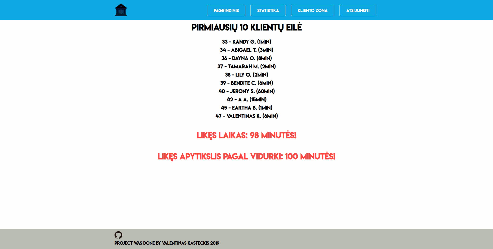

# Bank queue tickets

This project was made for the entrance to <b>NFQ academy</b>. Task can be found in <b>task.pdf</b> file. The whole idea behind this task is to make a way for customers who come to any bank and take waiting ticket number to see the estimated time left before they will be serviced.

# How to install

1. Download this project.
2. Upload everything to live server (FTP) except <b>task.pdf</b> and <b>database.sql</b>.
3. Upload <b>database.sql</b> file to your MySQL server.
4. Locate and open <b>database.config</b> file in <b>includes</b> folder.
5. Write your database information in this principle <b>HOST_SERVER:DB_USER:DB_PASSWORD:DB_NAME</b> for example <b>localhost:root::you_db_name</b>
6. You are good to go. Temporary spcialist loggings are username: <b>admin</b> and password: <b>admin</b>.

# Run this project locally with Docker
1. Have docker and Makefile installed
2. Clone this repository
3. `$ make prepare`
4. `$ make prepare-db`
5. visit `localhost:80`

# User/Specialist guide

1. You can register as a User by pressing <b>Prisijungti kaip klientui</b> on the navigation bar and then pressing <b>Neesate užisiregistravę? Užsiregistruokite!</b>
2. You can log in with the credentials you just created
3. Go to client zone by clicking on <b>Kliento zona</b>
4. Write the estimated time you will be there and click <b>Registruotis</b>
5. You can write your number to see the estimated waiting time left.
6. You can cancel your visit by clicking on <b>Atšaukti vizitą</b>
7. You can delay your visit by clicking on <b>Pavėlinti</b>
8. You can log out from the system and click on <b>Prisijungti kaip specialistui</b> to log in as a specialist. Temporary loggings are <b>admin/admin</b>
9. You can go to admin zone by clicking on <b>Admin zona</b>
10. When a client comes you can start the visit by clicking on <b>Klientas pradėtas aptarnauti</b> and when a client leaves you can click on <b>Klientas aptarnautas</b>. Also, you can see how much time you've spent servicing the client.
11. You can view statistics when exactly the place is busiest by clicking on <b>Statistika</b>

# What can be improved

1. Back-end validation can be manipulated by modifying GET/POST requests.
2. No password hashing.
3. MVC model is not perfect.
4. Not every acceptance criteria were done.

# What has been used

1. PHP 7.4
2. MySQL
3. HTML+CSS
4. MVC
